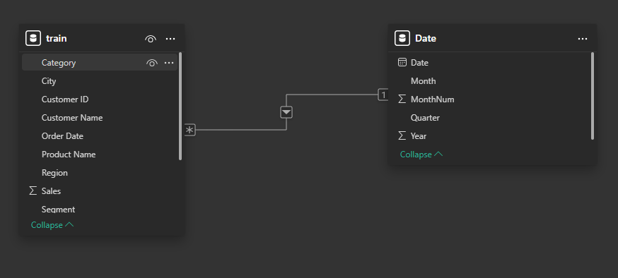
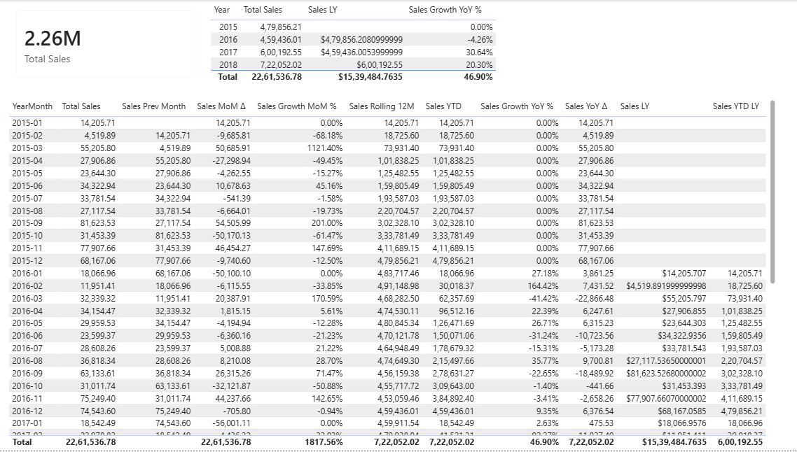
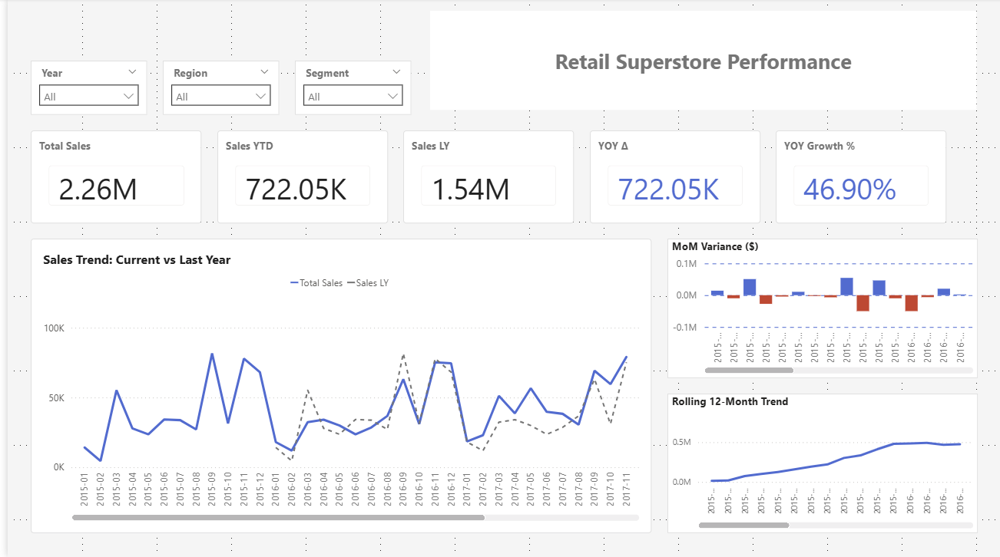
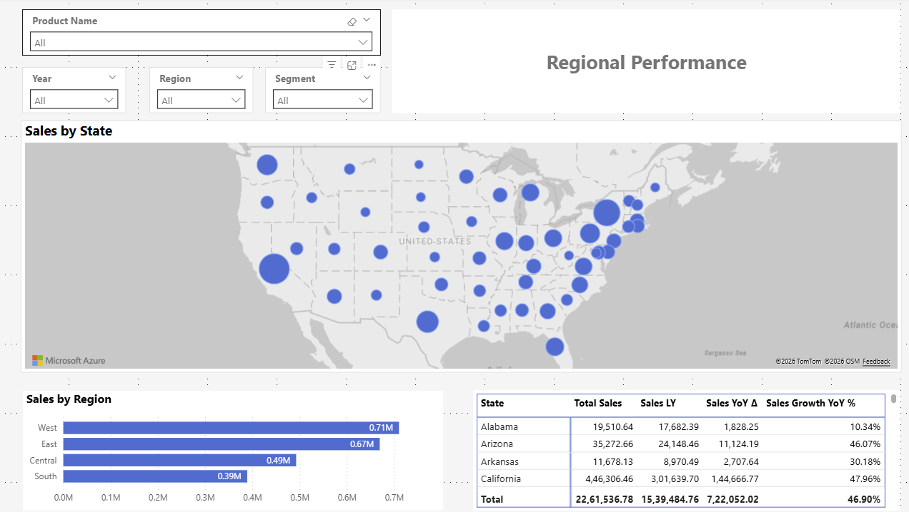
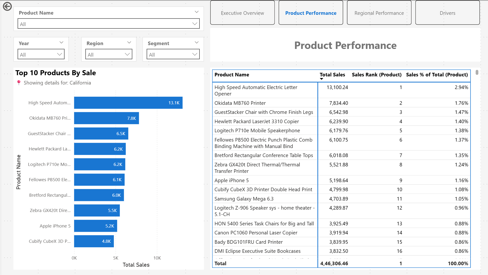
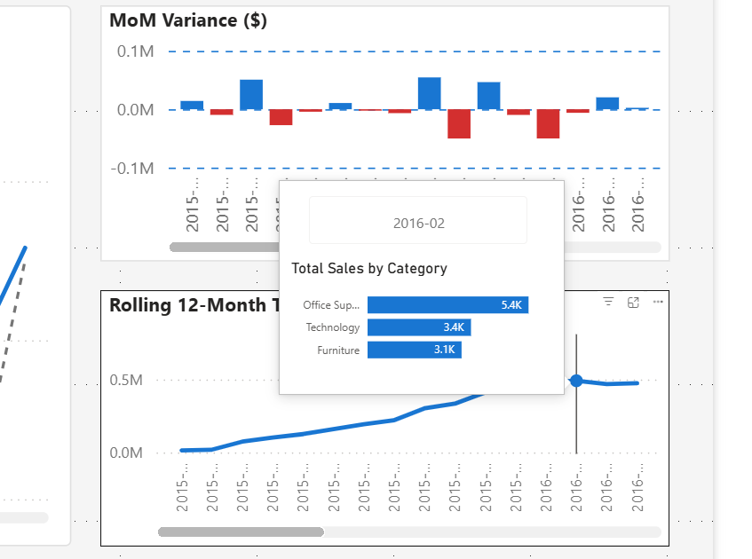
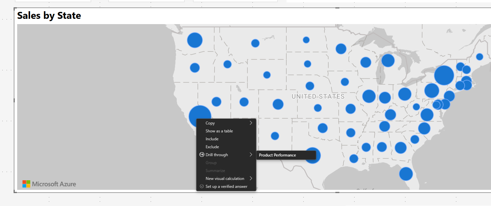
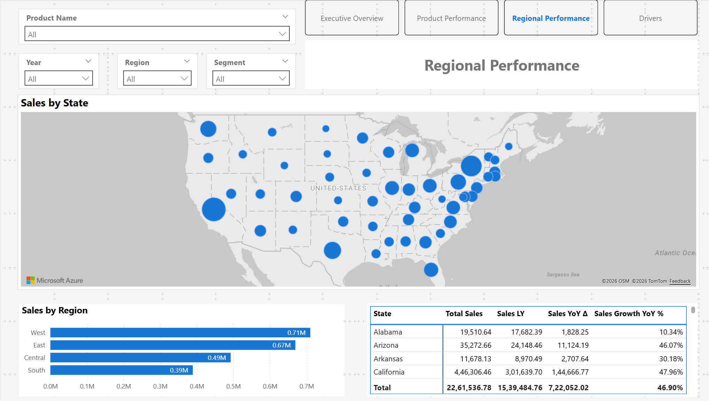
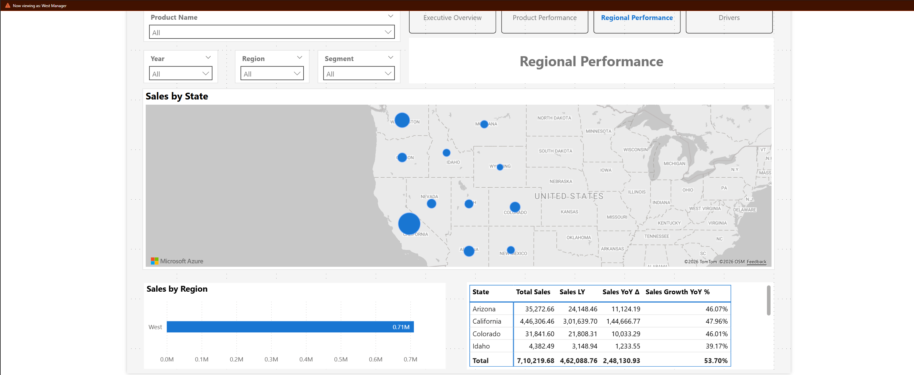

# Retail Superstore Dashboard

**End-to-end Power BI retail analytics project using [Kaggle Superstore dataset](https://www.kaggle.com/datasets/rohitsahoo/sales-forecasting) (9.8k orders). Demonstrates data preparation, semantic modeling, time-intelligence DAX, and polished report UX for PL-300 skills validation.**

---

## Project Goal
Build a CV/portfolio-ready Power BI dashboard showcasing:
- Clean data transformation (Power Query)
- Proper semantic modeling (Date table, relationships)
- Advanced time-intelligence measures (YoY, MoM, YTD, Rolling 12M)
- Professional report design (interactive slicers, conditional formatting, decomposition analysis)
- **Advanced UX & Security** (Custom tooltips, App-like navigation, RLS)

**Note**: This dataset contains sales data only (no profit/cost/quantity). The focus is demonstrating **time-intelligence** and **dimensional analysis**, not full P&L modeling.

---

## Tech Stack
- **Power BI Desktop**: Report authoring and modeling.
- **Power Query (M)**: Used for ETL (removing static columns, type conversion).
- **DAX**: Used for all calculated measures and time intelligence.
- **DAX Studio**: Used to export measure definitions for documentation/version control.

## Quick Start
1. Download [Retail-Superstore-Dashboard-V4.pbix](Retail-Superstore-Dashboard-V4.pbix)
2. Open in Power BI Desktop
3. Navigate using the top-right menu buttons or explore tooltips by hovering over charts.

---

## V1: Data Preparation (2026-01-14)
- Downloaded Rohit Sahoo's Superstore CSV from Kaggle.
- Power Query ETL: Removed Row ID, Order/Product ID, Postal Code, Country (identifier/static noise).
- Data types: Dates parsed, Sales as Decimal.
- Result: Clean 9.8k-row fact table ready for modeling.

---

## V2: Semantic Model + Time Intelligence Measures (2026-01-17)
V2 focuses on building a reusable semantic model and implementing validated time-intelligence measures.

### Date Dimension and Relationships
- Created a dedicated `'Date'` table and marked it as the model Date table.
- Established relationship: `'Date'[Date]` (1) → `train[Order Date]` (*).
- Added `YearMonth` (text) and `YearMonth Sort` (numeric) columns for chronological sorting.

### Measures Implemented (V2)
*All measures exported via DAX Studio to `docs/measures/v2-measures.csv` for version control.*

**Time Intelligence** (monthly grain, driven by `'Date'` table):
- `Total Sales`, `Sales Prev Month`, `Sales Growth MoM %`, `Sales MoM Δ`
- `Sales LY` (Last Year), `Sales Growth YoY %`, `Sales YoY Δ`
- `Sales YTD`, `Sales Rolling 12M` (Trailing Twelve Months)

**Product Analysis**:
- `Sales Rank (Product)` (Top-N ready with RANKX)
- `Sales % of Total (Product)` (uses REMOVEFILTERS)

### Measure Validation (V2)
Validation pages created to confirm calculations at time and product grain.

**Manual Checks Performed**:
- MoM: Apr 2015 (27.9K) → May 2015 (23.6K) = -15.27% ✓
- YoY: 2015 total (479.9K) vs 2016 total (459.4K) = -4.26% ✓

---

## V3: Polished Report UX with Interactive Visuals (2026-01-27)
V3 delivers a CV-ready, minimalistic report with 4 interactive pages demonstrating time-intelligence in action.

### Design Principles
- **Minimalist aesthetic**: Light gray canvas, white cards, consistent blue accent (#1976D2).
- **Synced slicers**: Year, Region, Segment filters apply consistently across pages.
- **Grid alignment**: Pixel-perfect layout for professional appearance.

### Page 1: Executive Overview
High-level KPIs and trends for executive-level insights.

**Visuals**:
- **5 KPI Cards**: Total Sales, Sales YTD, Sales LY, YoY Δ, YoY Growth %
- **Main Trend (Line Chart)**: Monthly sales (Current vs Last Year)
- **MoM Variance (Column Chart)**: Month-over-month change with conditional colors
- **Rolling 12M Trend (Line Chart)**: Smoothed long-term pattern

**Interactive Example** (Year = 2016):

### Page 2: Product Performance
Deep-dive into product-level sales with ranking and contribution analysis.

**Visuals**:
- **Top 10 Products (Bar Chart)**: Visual-level filter (Top N by Total Sales)
- **Product Matrix**: Detailed table with Total Sales, Rank, % of Total, YoY Δ
- **Search Slicer**: Product Name dropdown with search enabled

### Page 3: Region Performance
Geographic analysis with map visualization and state-level breakdown.

**Visuals**:
- **Sales by State (Bubble Map)**: Hero visual, full width, bubble size = Total Sales
- **Sales by Region (Bar Chart)**: High-level regional comparison
- **State Performance Matrix**: Detailed state metrics (Total Sales, LY, YoY Δ, YoY %)

### Page 4: Key Performance Drivers
Root-cause analysis using AI-powered Decomposition Tree.

**Visual**:
- **Decomposition Tree**: Analyze `Sales YoY Δ` by Region → State → Segment → Category → Product
- Users can click "+" to drill into drivers and use "High Value/Low Value" AI suggestions

---

## V4: Advanced UX & Security (2026-01-29)
V4 transforms the report into an "App-like" experience with advanced navigation and security features, focusing on end-user flow and data governance.
*New measures added (e.g., `Label State Context`) have been appended to the measures documentation.*

### 1. App-Like Navigation & Dynamic Context
- **Navigation Bar**: Added a custom navigation menu (top-right) to replace standard page tabs.
- **Dynamic Subtitles**: Implemented DAX-driven subtitles (e.g., *"📍 Showing details for: California"*) that appear only during drillthrough, ensuring users always know their data context.

### 2. Custom Tooltips (The "Why" Behind the Data)
- Replaced standard black text boxes with a custom **Report Page Tooltip** (`TT-Month`).
- **User Flow**: Executives hovering over a monthly trend spike instantly see the category breakdown driving that specific month's performance without leaving the main view.

### 3. Drillthrough Workflow
- Enabled deep-dive analysis from **Region (Page 3)** to **Product (Page 2)**.
- Users can right-click any state bubble to investigate specific product performance for that location.

### 4. Security & Data Governance (RLS)
**Scenario**: This dashboard is deployed to Regional Directors who must be restricted to their own territory's data.

**Implementation**:
- Utilized **Row-Level Security (RLS)** to enforce strict data boundaries.
- **Note**: Dynamic RLS (using `USERPRINCIPALNAME`) was designed but implemented as **Static RLS** due to the dataset lacking an employee directory dimension. Roles were created for `West`, `East`, `Central`, and `South`.

**Evidence of Security**:
*Left: Full Executive Access ($2.3M Sales). Right: Restricted "West Manager" View (Only West Region data visible).*

| Executive View (Unrestricted) | West Manager View (RLS Applied) |
|:---:|:---:|
|  |  |

---

## License
Data: [Kaggle Superstore Dataset](https://www.kaggle.com/datasets/rohitsahoo/sales-forecasting) by Rohit Sahoo (CC BY-NC-SA 4.0)  
Code/Report: MIT License

---

**Author**: [rishj606](https://github.com/rishj606)
