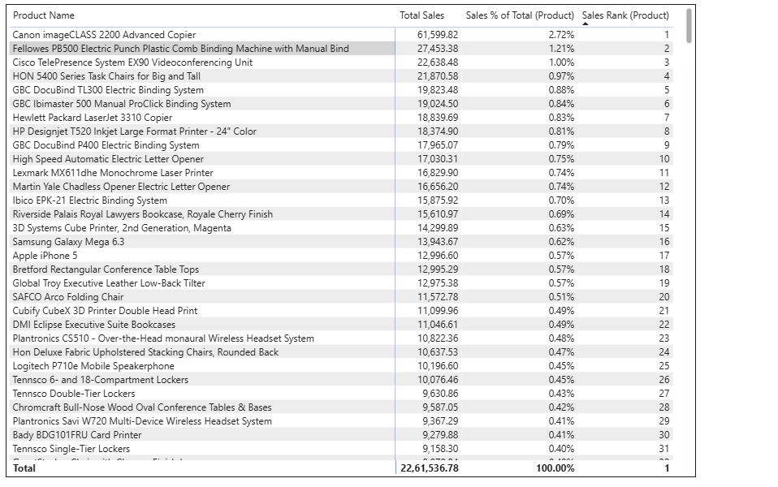

# Retail Superstore Dashboard

**End-to-end Power BI retail analytics project using [Kaggle Superstore dataset](https://www.kaggle.com/datasets/rohitsahoo/sales-forecasting) (9.8k orders). Progressive builds for PL-300 prep.**

## V1: Data Preparation (2026-01-14)
- Downloaded Rohit Sahoo's Superstore CSV.
- Power Query ETL: Removed Row ID, Order/Product ID, Postal Code, Country (identifier/static noise).
- Data types: Dates parsed, Sales/Profit as Decimal.
- Result: Clean 9.8k-row fact table ready for modeling.

## Tech Stack
- Power BI Desktop (latest)
- Power Query (M language)

## Upcoming
- V2: Date dimension, DAX KPIs (Total Sales, Profit Margin)
- V3: Interactive visuals, maps, slicers

## Quick Start
1. Download [V1.pbix](Retail-Superstore-Dashboard-V1.pbix)
2. Open in Power BI Desktop
3. Model view → Ready for relationships!

---

## V2: Semantic model + time intelligence measures (2026-01-17)
V2 focuses on building a reusable semantic model and implementing validated time-intelligence measures (MoM, YoY, YTD, Rolling 12M). The report pages in V2 are primarily for measure validation; the final polished dashboard visuals are planned for V3.

### Date dimension and sorting
- Created/validated a dedicated `'Date'` table and marked it as the model Date table.
- Added `YearMonth` and a numeric `YearMonth Sort` column to ensure chronological sorting in visuals.

Model relationship (Date ↔ train):

### Measures added in V2 (high level)
Time intelligence:
- Total Sales
- Sales Prev Month
- Sales Growth MoM %
- Sales MoM Δ (absolute variance)
- Sales LY
- Sales Growth YoY %
- Sales YoY Δ (absolute variance)
- Sales YTD
- Sales Rolling 12M

Product analysis:
- Sales Rank (Product)
- Sales % of Total (Product) using `REMOVEFILTERS()` to calculate correct contribution within the current filter context.

### Measure validation pages (V2)
Measure validation tables were added to confirm calculations at both time grain and product grain.

### Exporting measures (recommended for documentation)
In addition to documenting key measures here, all DAX measures can be exported via DAX Studio:
1. Open PBIX → External Tools → DAX Studio (or connect DAX Studio to the PBIX).
2. Run:
   `SELECT * FROM $SYSTEM.TMSCHEMA_MEASURES`
3. Export results to CSV/Excel (static) and commit to the repo (e.g., `docsmeasuresv2-measures.csv`).
